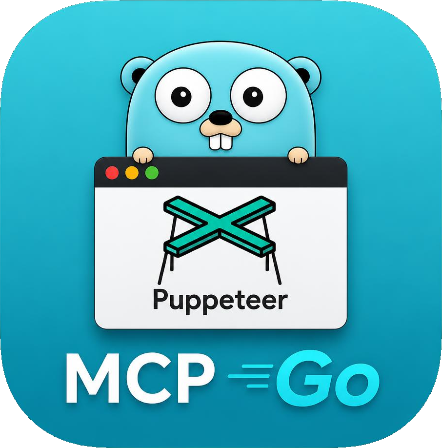

# puppeteer-mcp-go



A Model Context Protocol server, written in Go, that hands a coding agent a real Chrome browser.

It is for the three things a browser is actually needed for while building software: **testing** a web app by driving it, **debugging** a page by reading what it reported, and **building a Chrome extension**, where the parts that matter - the service worker, the content script, the popup - are each hard to reach by hand.

It implements MCP revision **2026-07-28**, and serves the older initialize-based revisions alongside it. The framework is the one from [code-mcp](https://github.com/chriswirz/code-mcp): the same protocol layer, the same transports, the same config shape.

You can create a chrome debugging instance using (on windows)

```
"C:\Program Files\Google\Chrome\Application\chrome.exe" --remote-debugging-port=9222 --user-data-dir="C:\tmp\chrome-cdp"
```

Or on linux
```
google-chrome --remote-debugging-port=9222 --user-data-dir="/tmp/chrome-cdp"
```

## Why not a screenshot

The obvious way to tell a model what is on a page is to send it a picture. 
It is also the wrong way most of the time: the image is large, it says nothing the model can act on, and having seen a button the model still has to invent a CSS selector to click it.

`browser_snapshot` walks the DOM instead, stamps every element worth naming with a ref, and returns an outline:

```
# Fixture page - file:///tmp/fixture.html
- heading 1 "Fixture page"  ref=s1e1
- button "Click me"  ref=s1e2
- textbox "Your name"  ref=s1e3
- p "nothing yet"  ref=s1e4
```

Those refs go straight back to `browser_click` and `browser_type`. There is no selector to guess at and no image to interpret. `browser_screenshot` is still there for when the question is genuinely visual - a layout that looks wrong, a style that is not applying.

## Why the event buffers

Every page this server sees has its console, its uncaught exceptions and its network requests recorded from the moment it appears. When something does not work, the answer is usually already sitting in `browser_console` or `browser_network` - no need to re-run the interaction while watching.

The record is scoped where it matters: a tool reports what the page said **during its own action**, so a failure from page load is not re-reported on every subsequent click as though that click had caused it.

## Install

Every push to `main` publishes a release at
[github.com/chriswirz/puppeteer-mcp-go/releases](https://github.com/chriswirz/puppeteer-mcp-go/releases)
with binaries for Linux, Windows and macOS on amd64 and arm64, `.deb` and `.rpm`
packages, and a `SHA256SUMS` file. Versions are `v0.1.<build number>` - `v0.1.0007`
is the seventh pipeline run, so a binary says which build produced it.

```sh
base=https://github.com/chriswirz/puppeteer-mcp-go/releases/latest/download
curl -fsSL -O $base/puppeteer-mcp-linux-amd64
curl -fsSL -O $base/SHA256SUMS
sha256sum --ignore-missing -c SHA256SUMS

sudo install -m 755 puppeteer-mcp-linux-amd64 /usr/local/bin/puppeteer-mcp
puppeteer-mcp --version
```

Or build it yourself:

```sh
git clone https://github.com/chriswirz/puppeteer-mcp-go
cd puppeteer-mcp-go
./build.sh          # or build.cmd on Windows
```

A local build stamps `0.1.0000-dev+<sha>`, so it is never mistaken for a release.

It drives the browser through [playwright-go](https://github.com/playwright-community/playwright-go), which needs its driver once:

```sh
go run github.com/playwright-community/playwright-go/cmd/playwright@v0.6000.0 install --with-deps chromium
```

If you already have Chrome installed, that is what it launches by default (`browser.channel: "chrome"`) - real Chrome, because that is what an extension will actually run in. The bundled Chromium is the fallback.

## Working alongside the browser

By default the browser is the model's alone. `--interactive` says a person is watching it and the two will take turns:

```sh
puppeteer-mcp --interactive
```

Or in `config.json`, which every flag has an equivalent for:

```json
"browser": { "interactive": true, "follow_active_tab": true }
```

The browser opens **at startup** rather than on the first tool call, so there is a window for you to use before the model does anything. `--start-url` (or `browser.start_url`) opens it on the page you care about instead of a blank tab.

Two more things change. Tool calls retarget onto **whichever tab has focus**, so opening a new tab and asking "what is wrong with this page" means the tab in front of you, not one selected ten minutes ago. And `browser_wait_for_user` becomes meaningful: the model puts a message on the page with a Continue button and waits, which is how it hands back for a login, a two-factor prompt, a human-verification check, or a decision that is not its to make. `browser_notify` says what it is doing without waiting.

Pressing Cancel comes back to the model as an error, so cancelling stops it rather than being ignored. In headless mode there is nobody to ask, and the tool says so immediately instead of blocking.

## The two modes

**Launch** (the default). The server starts Chrome against its own profile directory. Reproducible, can run headless, right for a test run.

```sh
puppeteer-mcp --headless
```

**Attach.** You start Chrome yourself with a debugging port, and the server connects to it.

```powershell
& "C:\Program Files\Google\Chrome\Application\chrome.exe" `
    --remote-debugging-port=9222 --user-data-dir=D:\chrome-debug
```
```sh
puppeteer-mcp --cdp http://127.0.0.1:9222
```

This is the mode for debugging: it is your window, you are already signed in, your extension is already loaded, and you watch what the agent does to it.

> `--user-data-dir` is not optional. Without it Chrome hands the command line to an already-running instance and never opens the port. This is the single most common reason the connection is refused.

When attaching, the server never closes your browser on exit - it only drops the connection.

## Connect an MCP client

Over stdio (the default), a client that launches the server as a subprocess:

```json
{
  "mcpServers": {
    "browser": {
      "command": "D:\\Source\\puppeteer-mcp-go\\puppeteer-mcp.exe",
      "args": ["--cdp", "http://127.0.0.1:9222"]
    }
  }
}
```

Over HTTP, for a client that connects to a URL:

```sh
puppeteer-mcp --transport http --url http://127.0.0.1:8770/mcp --token "$MCP_TOKEN"
```

Through an HTTPS tunnel, when the client cannot see this network at all:

```sh
puppeteer-mcp --tunnel https://tunnel.example.com --tunnel-key "$TUNNEL_API_KEY" \
              --token "$MCP_TOKEN" --no-eval --allow-host example.com
```

Over HTTP the server also answers `GET /favicon.ico` with its application icon - the same image the Windows executable carries - so a browser pointed at the endpoint shows the right thing in its tab. That route sits outside the bearer-token check, since a browser cannot attach one to a favicon request.

The MCP handler is served in process by the tunnel client, so no local port is involved; `--tunnel-only` binds none at all. When the tunnel server issues a session id, it is written straight back into the `tunnel` section of your `config.json`, so restarting the server reclaims the same public URL instead of being handed a new one. Naming `--tunnel-session-file` moves that id into a file of its own and leaves the config untouched - one store either way, never two that can disagree. Think about what you are exposing before you do this: the tunnel is public, and these tools drive a real browser holding your real sessions. Set a token.

## The tools

**Browser and pages** - `browser_status`, `browser_start`, `browser_pages`, `browser_select_page`, `browser_new_page`, `browser_close_page`, `browser_frames`

**Navigation** - `browser_navigate`, `browser_back`, `browser_forward`, `browser_reload`, `browser_wait_for`

**Interaction** - `browser_click`, `browser_type`, `browser_press_key`, `browser_hover`, `browser_select_option`, `browser_check`, `browser_upload_file`, `browser_scroll`, `browser_set_viewport`

**Inspection** - `browser_snapshot`, `browser_screenshot`, `browser_get_text`, `browser_get_html`, `browser_query`

**Debugging** - `browser_console`, `browser_network`, `browser_clear_events`, `browser_storage`

**Taking turns** - `browser_wait_for_user`, `browser_notify`

**Escape hatches** - `browser_evaluate`, `browser_cdp`, `browser_add_init_script`, `browser_route`

**Extensions** - `browser_extensions`, `browser_extension_eval`, `browser_extension_reload`, `browser_extension_page`, `browser_extension_storage`

Every tool acts on the current page unless it is passed a `page_id`.

### Prompts

`debug_page`, `test_flow`, `debug_extension`, `check_responsive` - the workflows written down, so the order is right the first time.

### Resources

Each open page is also a resource at `browser://page-1`, whose contents are its snapshot. A client can show what the browser is looking at without spending a tool call.

## Working on a Chrome extension

An extension is not one program. It is a background service worker holding the `chrome.*` APIs, a content script in an isolated world alongside the page, and popup or options pages that are ordinary documents on a `chrome-extension://` origin. Most extension debugging goes wrong by asking the wrong one a question - reading `chrome.storage` from the page, where it does not exist.

```sh
puppeteer-mcp --extension ./my-extension
```

Chrome will not load an unpacked extension with no window, so this forces a headed browser; `--headless` alongside `--extension` is refused rather than silently ignored.

- `browser_extensions` lists what is loaded, with each id and whether its worker is running. A stopped MV3 worker is normal - Chrome sleeps idle ones.
- `browser_extension_eval` runs code **inside the worker**, where `chrome.storage`, `chrome.runtime` and the rest actually exist. It wakes a sleeping worker first.
- `browser_extension_page` opens the popup as a normal tab you can snapshot and read the console of. A real popup closes the moment it loses focus, which is why debugging one in place is hopeless.
- `browser_extension_reload` after a code change. The worker picks it up immediately; a content script is only injected on page load, so pass `reload_pages: true`.

## Configuration

Everything has a working default. `config.json` is for the things you would otherwise repeat on the command line:

```sh
puppeteer-mcp --example-config > config.json
```

The settings worth knowing about:

| Key | Default | What it is for |
| --- | --- | --- |
| `browser.cdp_url` | `""` | Attach to your own Chrome instead of launching one. |
| `browser.headless` | `false` | No window. Forced off when extensions are loaded. |
| `browser.channel` | `chrome` | `chrome`, `chrome-beta`, `msedge`, or `chromium` for the bundled build. |
| `browser.profile_dir` | `profile` | Persistent user-data directory, so logins survive a restart. |
| `browser.extensions` | `[]` | Unpacked extension directories to load. |
| `browser.default_timeout_ms` | `15000` | How long any wait for an element runs. |
| `browser.event_buffer_size` | `500` | Console/network records kept per page. |
| `browser.allow_eval` | `true` | Turn off to withdraw `browser_evaluate`, `browser_cdp`, `browser_route` and `browser_add_init_script`. |
| `browser.allow_navigate_hosts` | `[]` | Restrict where `browser_navigate` may go. An entry matches subdomains too. |
| `browser.screenshot_dir` | `screenshots` | Where every capture is written. Relative to the working directory. |
| `browser.max_screenshot_bytes` | `1048576` | Past this, a screenshot comes back as its path alone rather than inline. |
| `server.screenshot_path` | `""` | Serve the screenshot directory over HTTP at this path, e.g. `/screenshots/`. Empty serves nothing. |
| `server.screenshot_listing` | `false` | Also serve a directory index at that path. |

### Fetching screenshots over HTTP

Every capture is written to `browser.screenshot_dir` and the tool returns the path - which is useless to a client that is not on the same machine as the server. Small images come back inline as well; anything past `browser.max_screenshot_bytes` is the path alone, which in practice is most full-page captures. Set `server.screenshot_path` and those files are served over the same listener (and the same tunnel) as the MCP endpoint, with `browser_screenshot` reporting the URL alongside the path:

```json
{ "server": { "transport": "http", "screenshot_path": "/screenshots/", "screenshot_listing": false } }
```

The subtree is read-only - `GET`, `HEAD` and preflights, nothing else - and open to any origin, since a capture is fetched by an `` or a viewer rather than read by script and the endpoint's `allowed_origins` would only get in the way. It is not otherwise unguarded: `server.auth_token`, if set, is required here too, accepted either as the usual bearer header or as a `?token=` query parameter, because an `` tag cannot set a header. Directory listing stays off unless you turn it on, so a caller who knows one filename does not also learn every other capture the session took.

### Pointing this at a browser you care about

Attach mode means the agent is driving a browser holding your real sessions. Two settings make that safe to do:

```sh
puppeteer-mcp --cdp http://127.0.0.1:9222 --no-eval --allow-host localhost,example.com
```

`--no-eval` withdraws the tools that run arbitrary code, and `--allow-host` stops navigation leaving the sites you named. The ordinary tools keep working.

## Tests

```sh
go test ./...                          # unit tests, no browser needed
PUPPETEER_MCP_E2E=1 go test -run E2E    # drives a real headless browser
```

The end-to-end tests walk the intended path - navigate, snapshot, act on the refs, read the console - and check the two failure modes that matter: a stale ref is explained rather than reported as a mystery, and a failed request is recorded where it can be found.
